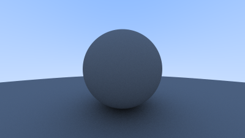
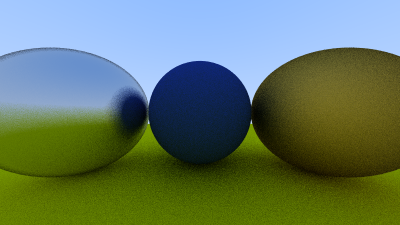

# Raytracing From Scratch

A beginner-friendly raytracing project focused on building a basic raytracer step by step, from scratch, using C++ and C. This repository is designed as a learning resource for graphics enthusiasts who wish to understand the inner workings of raytracing algorithms, without relying on third-party graphics libraries.

## Language Breakdown

- **C++:** 50.5%
- **C:** 34.8%
- **CMake:** 14.7%

The majority of this project is written in C++ for object-oriented design and modern language features. Critical performance sections and low-level utilities are implemented in C. The CMake build system ensures cross-platform compatibility and easy configuration.

## Features

- Basic ray-object intersections (spheres, planes, etc.)
- Scene definition and rendering
- Camera and viewport setup
- Image export
- Modular codebase for experimentation

## Getting Started

### Prerequisites

- C++17 compatible compiler (e.g., g++, clang++)
- CMake >= 3.10

### Build Instructions

```bash
git clone https://github.com/ASWINKMANOJ/Raytracing-From-Scratch.git
cd Raytracing-From-Scratch
mkdir build && cd build
cmake ..
make
```

### Run

After building, the executable will be located in the `build` folder. Run it to generate rendered images:

```bash
./raytracer
```

Images will be saved in the project directory.

## Example Output





*For more example images, see the `docs` or `images` folder.*

## Project Structure

```
Raytracing-From-Scratch/
├── src/          # C++ and C source files
├── include/      # Header files
├── cmake/        # CMake modules
├── docs/         # Documentation
├── images/       # Rendered outputs
└── README.md     # This file
```

## Contributing

Contributions, bug reports, and feature requests are welcome! Please open an issue or submit a pull request.

## License

This project is licensed under the MIT License. See the [LICENSE](LICENSE) file for details.

## Acknowledgments

Inspired by "Ray Tracing In One Weekend" and other graphics learning resources.

---

**Happy tracing!**
